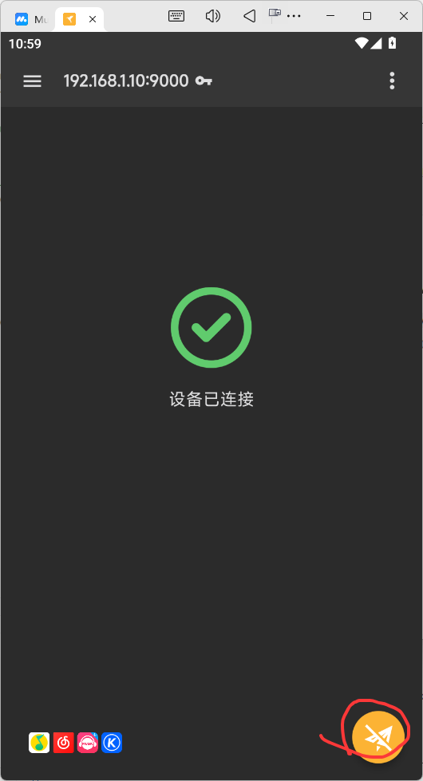
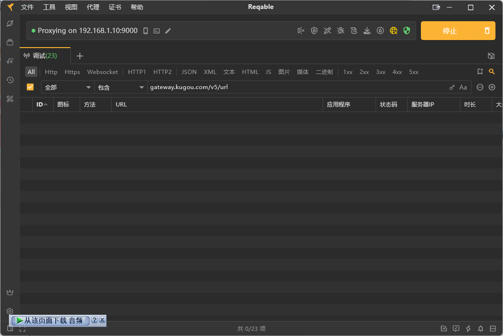
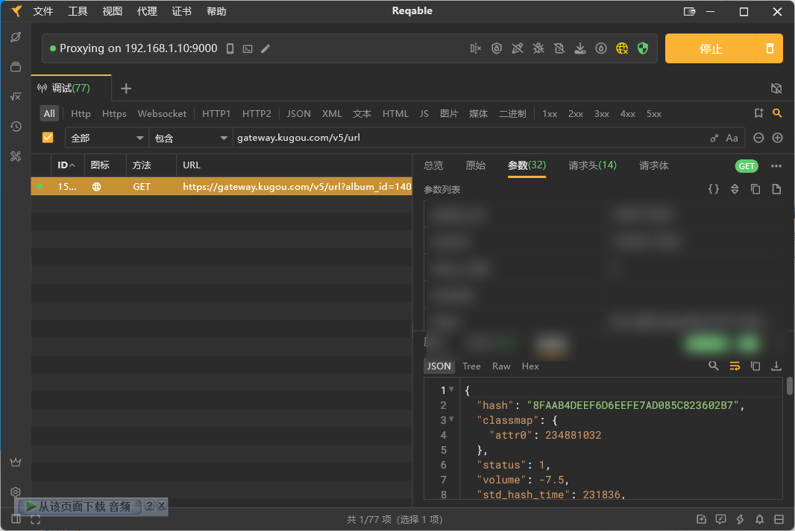

# 抓包各平台用户信息
以下内容均为Windows + Reqable + Mumu模拟器配合使用  
需要文件下载:  
[酷狗音乐](https://download.kugou.com/dl/kugou_android)  
[QQ音乐](https://y.qq.com/download/download.html)  
[网易云音乐](https://music.163.com/#/download)  
[咪咕音乐](https://h5.nf.migu.cn/app/v5/p/download-music/index.html?&cfrom=014002G_ctjh&dchannel=014002G_ctjh)  
[Reqable](https://reqable.com)  

## 酷狗音乐

1. 打开Reqable，开始抓包  
  

2. 打开酷狗音乐，在PC端Reqable先预设好搜索  
  

3. 在酷狗音乐随便点一首歌  
  

4. 在Reqable PC端找到v5/url这个包  
  

在参数中找到userid和token这两个值就可以在配置文件里填写了